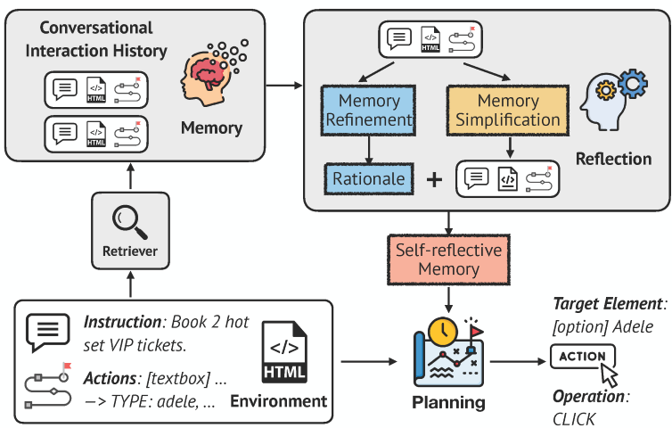

# Self-MAP

<p align="center">
   <!-- Adjust the width as needed -->
  <br>
  Official Implementation of <em>On the Multi-turn Instruction Following for Conversational Web Agents</em> (<a href="https://arxiv.org/abs/2402.15057">Paper</a>, <a href="https://huggingface.co/datasets/magicgh/MT-Mind2Web">Datasets</a>)
</p>


## Setup
Use Python version <= 3.11, and install the required packages using the following command:
```bash
pip install -r requirements.txt
```

## Usage
1. Download the MT-Mind2Web dataset and place it in the `data/` directory.
2. Fill in the DATA_PATH and LOG_PATH variables as within the [`src/candidate_generation/conf/config.yaml`](./src/candidate_generation/conf/config.yaml) and [`src/action_prediction/conf/config.yaml`](./src/action_prediction/conf/config.yaml) files.  

    ```yaml
    data:
        data_path: $(DATA_PATH)
        train_split_file: data/train/*.json
        test_split_files:
            test_task: data/test_task/*.json
            test_website: data/test_website/*.json
            test_subdomain: data/test_subdomain/*.json
    ```
    ```yaml
    hydra:
        run:
            dir: $(LOG_PATH)
    ```
3. Set the environment variable `OPENAI_API_KEY` to your OpenAI API key.

## Candidate Generation
### Fine-tuning
```bash
python src/candidate_generation/train.py model=deberta-v3-base
```
### Evaluation
Generate the ranks and scores for element candidates within the test-X set, where X can represent *task*, *website*, or *subdomain*.
```bash
python src/candidate_generation/evaluate.py\
    --model_path ${MODEL_PATH}\
    --data_path ${DATA_PATH}\
    --split_file data/test_${X}/*.json\
    --output_dir ${OUTPUT_PATH}\
```
### Generate Pickle Files
Generate the pickle files for conversational action planning.
```python
import pickle

def load_pickle(file_path):
    with open(file_path, 'rb') as file:
        data = pickle.load(file)
    return data

def write_pickle(data, file_path):
    with open(file_path, 'wb') as file:
        pickle.dump(data, file)

all_dict = {"scores": {}, "ranks": {}}
for file_path in [test_task_path, test_website_path, test_subdomain_path]:
    data = load_pickle(file_path)
    for key in ["scores", "ranks"]:
        for annotation_id, element in data[key].items():
            all_dict[key].setdefault(annotation_id, {}).update(element)

write_pickle(all_dict, output_path)
```
## Conversational Action Planning
### Fine-tuning
```bash
torchrun --nproc-per-node 4 --master_port=10086 \
    /src/action_prediction/train.py \
    model=flan-t5-base \
    train.per_device_train_batch_size=8 \
    train.gradient_accumulation_steps=1 \
    train.fsdp=False \
    train.num_gpus=4 \
    train.epoch=5 \
    run_id="full" \
    ++self_map.generation=False \
    ++self_map.memory_simplification=False \
    ++self_map.memory_refinement=False \
    ++self_map.multifaceted_matching=False \
```
### Evaluation
```bash
python src/action_prediction/evaluate.py\
  +model_path=${MODEL_PATH}\
  model=flan-t5-base\
  +output_path=${OUTPUT_PATH}\
  +top_k=50\
  ++self_map.generation=False \
  ++self_map.memory_simplification=False \
  ++self_map.memory_refinement=False \
  ++self_map.multifaceted_matching=False \
```
Set *self_map.${generation, memory_simplification, memory_refinement, multifaceted_matching}* to True to enable the corresponding module.

## LICENSE
Our code is derived from the [Mind2Web](https://github.com/OSU-NLP-Group/Mind2Web/) project under the MIT License.  
Our MT-Mind2Web dataset is made available under the [CC-BY-4.0](https://creativecommons.org/licenses/by/4.0/) license.

## Citation
```
@inproceedings{self-map,
    author = {Deng, Yang and Zhang, Xuan and Zhang, Wenxuan and Yuan, Yifei and Ng, See-Kiong and Chua, Tat-Seng},
    booktitle = {ACL 2024},
    title = {On the Multi-turn Instruction Following for Conversational Web Agents},
    year = {2024}
}
```
